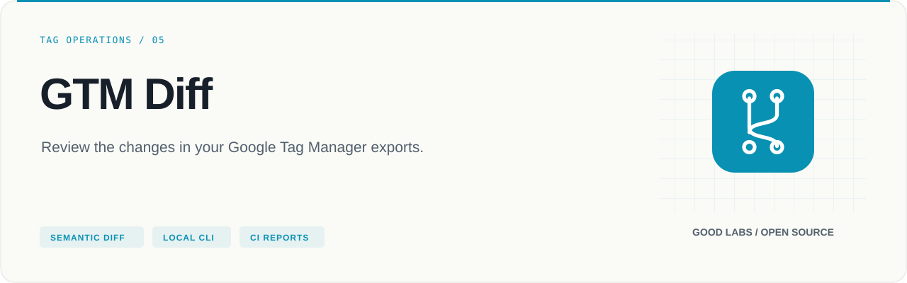
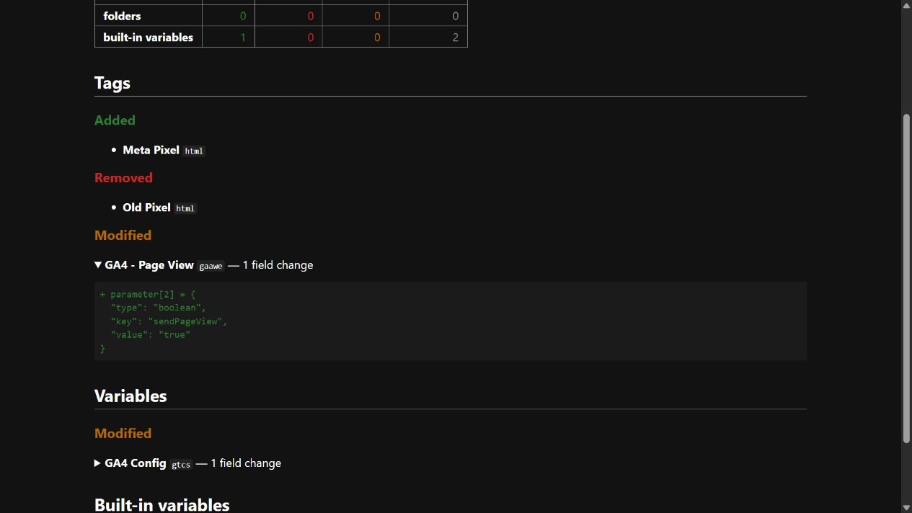

<p align="center">
  
</p>

# GTM Diff

Review the changes in your Google Tag Manager exports.

[](https://github.com/arcbaslow/gtm-diff/actions/workflows/tests.yml)
[](https://github.com/arcbaslow/gtm-diff/releases)
[](#quick-start)
[](LICENSE)

[Quick start](#quick-start) · [Example output](#example-output) · [Tests](#tests) · [Releases](#releases) · [Contributing](CONTRIBUTING.md)

A local CLI and TypeScript library for comparing two Google Tag Manager container exports. It resolves GTM IDs to names and removes volatile metadata so reviewers can focus on changes to tags, triggers, variables and folders.

**Implemented:** `diff`, console/Markdown/HTML reports and CI exit codes. **Not implemented:** `plan`, `apply` or live GTM synchronization. The tool reads local exports and makes no GTM API calls.

## Quick start

Requires **Node.js 20+**. Build from source:

```bash
git clone https://github.com/arcbaslow/gtm-diff.git
cd gtm-diff
npm ci
npm run build
node bin/run.js diff test/fixtures/minimal-before.json test/fixtures/minimal-after.json
```

After building, `npm link` optionally makes the `gtm-diff` command available globally. The source instructions work without an npm registry publication.

## Example output



The screenshot shows the **actual HTML reporter** comparing the two bundled synthetic GTM exports. Generate the same report:

```bash
node bin/run.js diff test/fixtures/minimal-before.json test/fixtures/minimal-after.json --format html --output diff.html
node bin/run.js diff test/fixtures/minimal-before.json test/fixtures/minimal-after.json --format markdown --output diff.md
```

Read the [generated Markdown report](examples/demo/report.md) and the original [before](test/fixtures/minimal-before.json) / [after](test/fixtures/minimal-after.json) fixtures.

## Compare your own containers

Export JSON from GTM's **Admin → Export Container**, then:

```bash
node bin/run.js diff before.json after.json
node bin/run.js diff before.json after.json --format markdown --output diff.md
node bin/run.js diff before.json after.json --format html --output diff.html
node bin/run.js diff before.json after.json --exit-code --no-color
```

| Option | Behavior |
| --- | --- |
| `-f, --format` | `console` (default), `markdown` or `html` |
| `-o, --output` | Write the report to a file instead of stdout |
| `--no-color` | Disable console ANSI colors |
| `--exit-code` | Return `1` when differences exist; unchanged exports return `0` |

Invalid files and command errors also return a nonzero exit status; use the report and error output to distinguish them from detected changes.

## What the comparison means

| Normalization | Why it matters |
| --- | --- |
| Match entities by type and name | IDs can differ between workspaces or environments |
| Strip IDs, fingerprints, paths and other volatile fields | Export metadata does not overwhelm the review |
| Resolve trigger, folder and tag references to names | References remain meaningful after ID changes |
| Sort parameter lists where order is not significant | Serialization order does not create false changes |
| Preserve known order-sensitive lists | E-commerce item ordering is still compared |
| Key built-in variables by type | Export order does not affect identity |

A renamed entity appears as removed plus added. This is a semantic export comparison; it does not validate whether the resulting tracking behavior is correct on a website.

## Use in CI

Build this repository, run the CLI against your two exports, and upload the report as an artifact. This repository already tests the same fixture pair; a minimal local CI step after `npm ci` and `npm run build` is:

```bash
node bin/run.js diff before.json after.json --format markdown --output diff.md --exit-code
```

Omit `--exit-code` when differences are expected and the job should produce a report without failing on a change. Supply `before.json` from a trusted baseline and `after.json` from the proposed change. No OAuth token is required.

## Use as a library

Inside a built checkout:

```ts
import { loadGtmExport, diffExports, renderMarkdown } from './dist/index.js';

const before = await loadGtmExport('before.json');
const after = await loadGtmExport('after.json');
console.log(renderMarkdown(diffExports(before, after)));
```

After installing a release tarball into another project, import from `gtm-diff` instead. Public exports are defined in [src/index.ts](src/index.ts).

## Tests

```bash
npm test
npm run typecheck
npm run lint
npm run format:check
npm run build
```

Vitest covers export parsing, ID normalization, semantic diffs, reporters and HTML escaping. CI runs these checks on **Ubuntu and Windows**, across **Node 20, 22 and 24**. It requires no Google credentials. For watch mode, use `npm run test:watch`; for a source CLI run, use `npm run dev -- diff before.json after.json`. See the [release verification](docs/VERIFICATION.md).

## Repository map

| Path | Purpose |
| --- | --- |
| [src/](src/) | Parser, normalizer, diff engine, reporters and CLI commands |
| [bin/](bin/) | CLI entry points |
| [test/](test/) | Unit tests and synthetic container fixtures |
| [examples/demo/](examples/demo/) | Generated reports |
| [docs/](docs/) | Release notes and verification |

## Releases

**[v0.1.0](https://github.com/arcbaslow/gtm-diff/releases/tag/v0.1.0)** — see the [release notes](docs/RELEASE_NOTES.md) for this release and the [changelog](CHANGELOG.md) for project history.

GitHub Releases include downloadable artifacts and checksums. Package-registry publication is a separate, opt-in workflow; a GitHub release does not imply that the same version is available on PyPI or npm. Maintainers can follow the [release guide](docs/RELEASING.md).

## Contributing

Read [CONTRIBUTING.md](CONTRIBUTING.md), run the checks above, and include a minimal reproduction for bugs. Report vulnerabilities through [SECURITY.md](SECURITY.md).

## Related tools

| Project | Use it for |
| --- | --- |
| [Google Ads Agents](https://github.com/arcbaslow/google-ads-agents) | Paid media audits, tracking checks and reviewed changes. |
| [Google Analytics Agent](https://github.com/arcbaslow/google-analytics-agent) | GA4 data quality, funnels and property management. |
| [Search Console Agent](https://github.com/arcbaslow/google-search-console-agent) | Search performance, indexing and page experience. |
| [Meta Ads Agents](https://github.com/arcbaslow/meta-ads-agents) | Campaign performance, creative fatigue and event health. |
| [Figma Taxonomy Gen](https://github.com/arcbaslow/figma-taxonomy-gen) | Turn interactive designs into a reviewable tracking plan. |

Maintained by [Good Labs](https://goodlabs.kz) — measurement implementation, tracking plans and analytics audits.

## License

[MIT](LICENSE) © Dilshat Rakhimov. This is an independent project; it is not an official product of the platform vendors.
