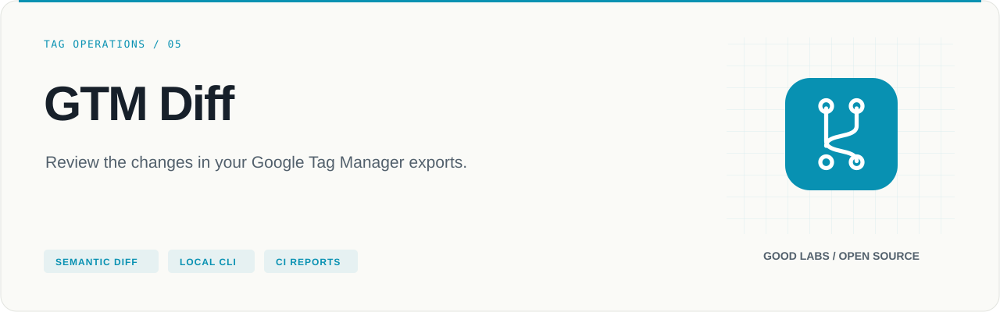
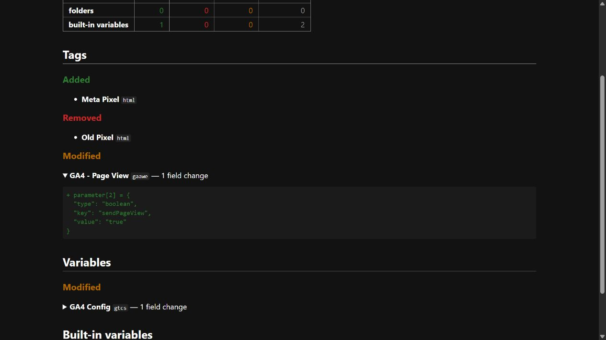

<p align="center">
  
</p>

# GTM Diff

Review the changes in your Google Tag Manager exports.

[](https://github.com/arcbaslow/gtm-diff/actions/workflows/tests.yml)
[](https://github.com/arcbaslow/gtm-diff/releases)
[](#quick-start)
[](LICENSE)

[Quick start](#quick-start) · [Example output](#example-output) · [Tests](#tests) · [Releases](#releases) · [Contributing](CONTRIBUTING.md)

A local CLI and TypeScript library for comparing two Google Tag Manager container exports. It resolves GTM IDs to names and removes volatile metadata so reviewers can focus on changes to tags, triggers, variables and folders.

**Implemented:** `diff`, console/Markdown/HTML/JSON reports and CI exit codes. **Not implemented:** `plan`, `apply` or live GTM synchronization. The tool reads local exports and makes no GTM API calls.

## Quick start

Requires **Node.js 20+**. Build from source:

```bash
git clone https://github.com/arcbaslow/gtm-diff.git
cd gtm-diff
npm ci
npm run build
node bin/run.js diff test/fixtures/minimal-before.json test/fixtures/minimal-after.json
```

After building, `npm link` optionally makes the `gtm-diff` command available globally. The source instructions work without an npm registry publication.

## Example output



The screenshot shows the **v0.1 HTML reporter** comparing the two bundled synthetic GTM exports. Current reports also include summary rows for clients, transformations, templates, zones and Google tag configs. Generate a current report:

```bash
node bin/run.js diff test/fixtures/minimal-before.json test/fixtures/minimal-after.json --format html --output diff.html
node bin/run.js diff test/fixtures/minimal-before.json test/fixtures/minimal-after.json --format markdown --output diff.md
```

Read the [generated Markdown report](examples/demo/report.md) and the original [before](test/fixtures/minimal-before.json) / [after](test/fixtures/minimal-after.json) fixtures.

## Compare your own containers

Export JSON from GTM's **Admin → Export Container**, then:

```bash
node bin/run.js diff before.json after.json
node bin/run.js diff before.json after.json --format markdown --output diff.md
node bin/run.js diff before.json after.json --format html --output diff.html
node bin/run.js diff before.json after.json --format json --output diff.json
node bin/run.js diff before.json after.json --exit-code --no-color
```

| Option | Behavior |
| --- | --- |
| `-f, --format` | `console` (default), `markdown`, `html` or `json` |
| `-o, --output` | Write the report to a file instead of stdout |
| `--no-color` | Disable console ANSI colors |
| `--exit-code` | Return `1` when differences exist; unchanged exports return `0` |
| `--strict` | Return `2` before writing a report when container-version fields are omitted |

Exit status is `0` on success (including differences when `--exit-code` is omitted), `1` for detected differences with `--exit-code`, and `2` for diff command, input or output errors. Errors go to stderr. Reports go to stdout unless `--output` is supplied; the selected file is written before returning `1`. When both inputs are invalid, the before-file error is reported first. Help returns `0`.

## What the comparison means

Inputs are limited to 32 MiB per file, 128 object/array nesting levels and 500,000 values. Limit failures return status 2 before report output. One leading UTF-8 BOM is accepted. See [input limits and fixture coverage](docs/INPUT_LIMITS.md).

| Normalization | Why it matters |
| --- | --- |
| Match named entities by type and name | IDs can differ between workspaces or environments; Google tag configs use type and source ID because they have no documented name |
| Strip IDs, fingerprints, paths and other volatile fields | Export metadata does not overwhelm the review |
| Resolve supported trigger-ID arrays and folder references to names | References remain meaningful after ID changes; tag references already use names |
| Sort keyed parameter and map collections | Serialization order does not create false changes |
| Preserve every parameter list in authored order | E-commerce, custom and keyless list ordering is still compared |
| Sort condition sets and object keys recursively | Equivalent JSON property and condition order produces identical reports |
| Retain unknown parameter and condition fields | New fields remain visible to reviewers |
| Key built-in variables by type | Export order does not affect identity |

A renamed entity appears as removed plus added. This is a semantic export comparison; it does not validate whether the resulting tracking behavior is correct on a website.

Malformed entity entries, parameter trees and reference arrays fail validation with a location. Duplicate `(type, name)` identities (or built-in types), ambiguous identity keys, duplicate source IDs and duplicate keyed parameters are rejected instead of silently selecting one entry. These checks also apply to `normalizeExport` and `diffExports` library calls. Unknown fields on supported entities are retained; this is not a complete GTM schema validator.

Comparison covers container metadata and all ten documented entity collections: tags, triggers, variables, folders, built-in variables, clients, transformations, custom templates, zones and Google tag configs. Template text is compared without execution. Zone evaluation trigger IDs resolve to names. Google tag configs require a nonempty `gtagConfigId`; an ID change is removed plus added. Template-backed type identifiers remain raw, so relocated template IDs can still produce differences.

Documented singleton Parameters in triggers, tag priority/consent and variable conversions follow the same map/list rules as parameter arrays. Nested trigger-reference Parameters resolve to target type/name; missing or built-in targets retain explicit unresolved IDs. Tag references remain names. These newly consumed Parameter structures are validated; unknown extension fields remain uninterpreted. See the [Parameter contract](docs/PARAMETERS.md) for the normalized library representation and remaining limits.

Reports list unknown `containerVersion` fields that were omitted and qualify clean results as “No changes in compared fields.” Use `--strict` to reject incomplete coverage before writing a report. Empty unknown arrays contain no entities and do not trigger a notice. Known version metadata (including version name, description and deleted status) and the export envelope are intentionally excluded. Unknown fields within supported entities remain compared. This coverage check is not full schema or behavior validation. See the [coverage contract](docs/COVERAGE.md) and [roadmap](docs/ROADMAP.md).

## Use in CI

Reports treat exports as inert data. Labels omit terminal controls and line separators; diff values and paths show those characters as visible JSON escapes. HTML and Markdown HTML fragments escape container text. Report files can still contain secrets from exports, so choose where to store or share them explicitly.

Build this repository, run the CLI against your two exports, and upload the report as an artifact. This repository already tests the same fixture pair; a minimal local CI step after `npm ci` and `npm run build` is:

```bash
node bin/run.js diff before.json after.json --format markdown --output diff.md --exit-code
```

Omit `--exit-code` when differences are expected and the job should produce a report without failing on a change. Supply `before.json` from a trusted baseline and `after.json` from the proposed change. No OAuth token is required.

See the [CI contract and status-handling example](docs/CI.md). Reports do not post themselves as comments or call GitHub APIs.

For machine processing, use `--format json`. Its version 1 contract includes `schemaVersion`, `hasChanges`, coverage omissions, entity counts, full changed normalized entities and typed field paths/values. JSON escapes preserve data strings without truncation; source/target display labels are sanitized. Parsed strings remain untrusted and need escaping when rendered. See the [JSON report contract](docs/JSON_REPORT.md). The library also exports `renderJson` and `JsonReportV1`.

## Use as a library

Inside a built checkout:

```ts
import { loadGtmExport, diffExports, renderMarkdown } from './dist/index.js';

const before = await loadGtmExport('before.json');
const after = await loadGtmExport('after.json');
console.log(renderMarkdown(diffExports(before, after)));
```

After installing a release tarball into another project, import from `gtm-diff` instead. Public exports are defined in [src/index.ts](src/index.ts).

## Tests

Tests use Vitest 4 with Vite 6 to retain Node 20/22/24 support. Dependency audit results and supported-runtime verification are recorded in [dependency maintenance](docs/DEPENDENCIES.md).

```bash
npm test
npm run typecheck
npm run lint
npm run format:check
npm run build
```

Vitest covers export parsing, ID normalization, semantic diffs, reporters and HTML escaping. CI runs these checks on **Ubuntu and Windows**, across **Node 20, 22 and 24**. It requires no Google credentials. For watch mode, use `npm run test:watch`; for a source CLI run, use `npm run dev -- diff before.json after.json`. See the [release verification](docs/VERIFICATION.md).

## Repository map

| Path | Purpose |
| --- | --- |
| [src/](src/) | Parser, normalizer, diff engine, reporters and CLI commands |
| [bin/](bin/) | CLI entry points |
| [test/](test/) | Unit tests and synthetic container fixtures |
| [examples/demo/](examples/demo/) | Generated reports |
| [docs/](docs/) | Release notes and verification |

## Releases

**[v0.1.0](https://github.com/arcbaslow/gtm-diff/releases/tag/v0.1.0)** — see the [release notes](docs/RELEASE_NOTES.md) for this release and the [changelog](CHANGELOG.md) for project history.

GitHub Releases include downloadable artifacts and checksums. Package-registry publication is a separate, opt-in workflow; a GitHub release does not imply that the same version is available on PyPI or npm. Maintainers can follow the [release guide](docs/RELEASING.md).

## Contributing

Read [CONTRIBUTING.md](CONTRIBUTING.md), run the checks above, and include a minimal reproduction for bugs. Report vulnerabilities through [SECURITY.md](SECURITY.md).

## Related tools

| Project | Use it for |
| --- | --- |
| [Google Ads Agents](https://github.com/arcbaslow/google-ads-agents) | Paid media audits, tracking checks and reviewed changes. |
| [Google Analytics Agent](https://github.com/arcbaslow/google-analytics-agent) | GA4 data quality, funnels and property management. |
| [Search Console Agent](https://github.com/arcbaslow/google-search-console-agent) | Search performance, indexing and page experience. |
| [Meta Ads Agents](https://github.com/arcbaslow/meta-ads-agents) | Campaign performance, creative fatigue and event health. |
| [Figma Taxonomy Gen](https://github.com/arcbaslow/figma-taxonomy-gen) | Turn interactive designs into a reviewable tracking plan. |

Maintained by [Good Labs](https://goodlabs.kz) — measurement implementation, tracking plans and analytics audits.

## License

[MIT](LICENSE) © Dilshat Rakhimov. This is an independent project; it is not an official product of the platform vendors.
